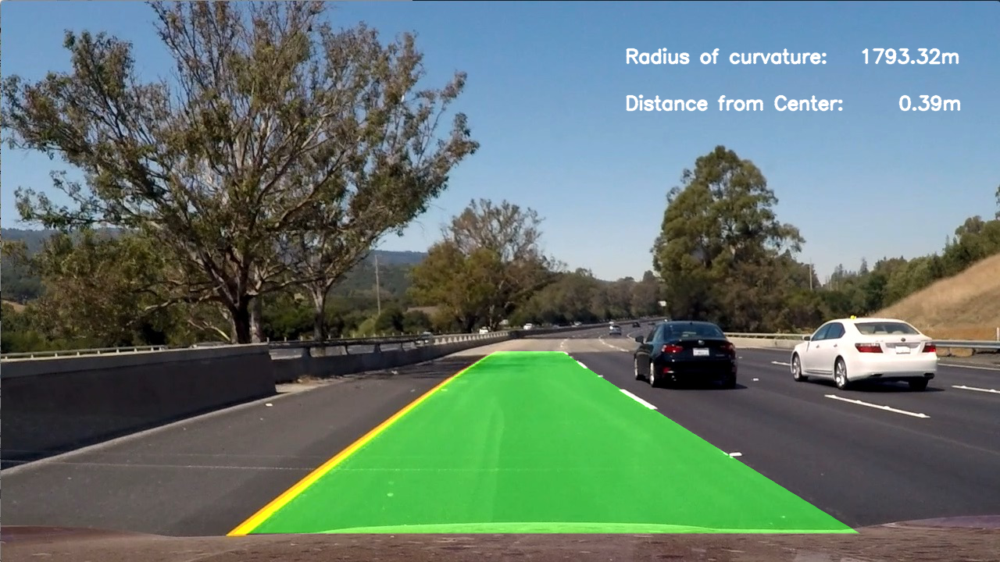

## Advanced Lane Finding - Project 2

The submission consists of the following items:

* project2.ipynb  - iPython notebook containing the code
* writeup.pdf     - report accompanying the project
* outputVideo.mp4 - result of the pipeline applied to the project_video.mp4

`outputImages/` - The output images represent each of the steps in the rubric applied to a single test image.

* 0_chessboardRaw.jpg		- raw chessboard for camera calibration
* 0_chessboardUndistort.jpg	- camera-calibrated undistorted chessboard
* 1_Raw.jpg		- original image
* 2_1_Distortion.jpg	- with distortion correction after camera calibration
* 2_2B_HLS.jpg		- with HLS colour Conversion
* 2_2C_SChannel.jpg	- with S-Channel isolated
* 2_2D_ColorBin.jpg	- binary of colour threshold
* 2_2E_GradBin.jpg	- binary of all gradient thresholds combined
* 2_2F_GradColorSplitBin.jpg - binary of gradient + colour, split
* 2_2G_GradColorCombinedBin.jpg - binary of gradient + colour, combined
* 2_3_PerspectiveTransform.jpg	- perspective transformed image
* 2_4_priorSearch.jpg 	- best fit line from `priorSearch()`
* 2_4_slidingWindows.jpg - best fit line by use of `slidingWindows()`
* 2_5_DrawLane.jpg	- lane superimposed on road (like a HUD)
* 2_6_Result.jpg		- final Result with values drawn on

`outputtest_images/` - contain each of the test images, with the image processing pipeline applied and saved

`test_images/` - images provided with the project, provided here for completeness sake

---
## The Project
The goals / steps of this project are the following:

* Compute the camera calibration matrix and distortion coefficients given a set of chessboard images.
* Apply a distortion correction to raw images.
* Use colour transforms, gradients, etc., to create a thresholded binary image.
* Apply a perspective transform to rectify binary image ("birds-eye view").
* Detect lane pixels and fit to find the lane boundary.
* Determine the curvature of the lane and vehicle position with respect to center.
* Warp the detected lane boundaries back onto the original image.
* Output visual display of the lane boundaries and numerical estimation of lane curvature and vehicle position.
